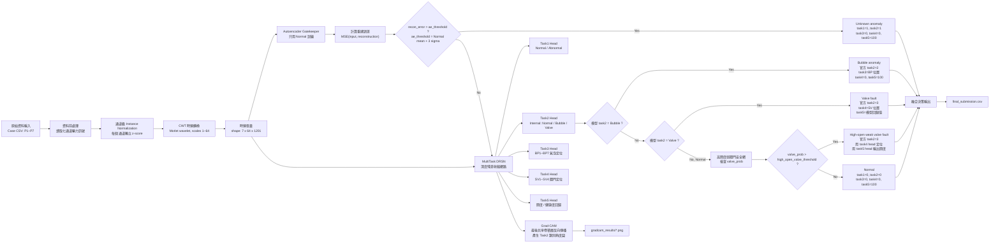
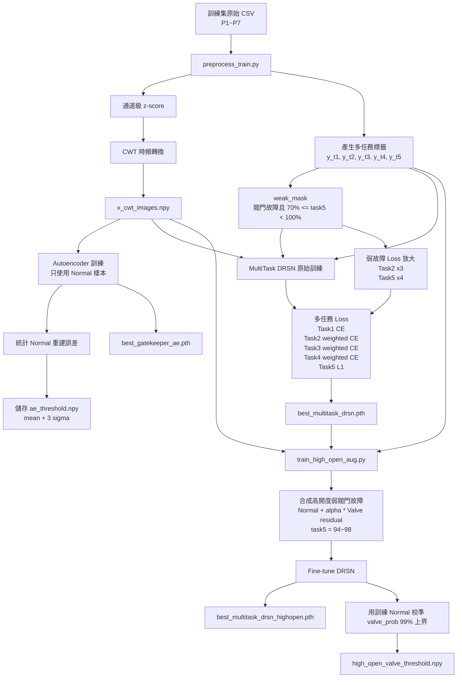
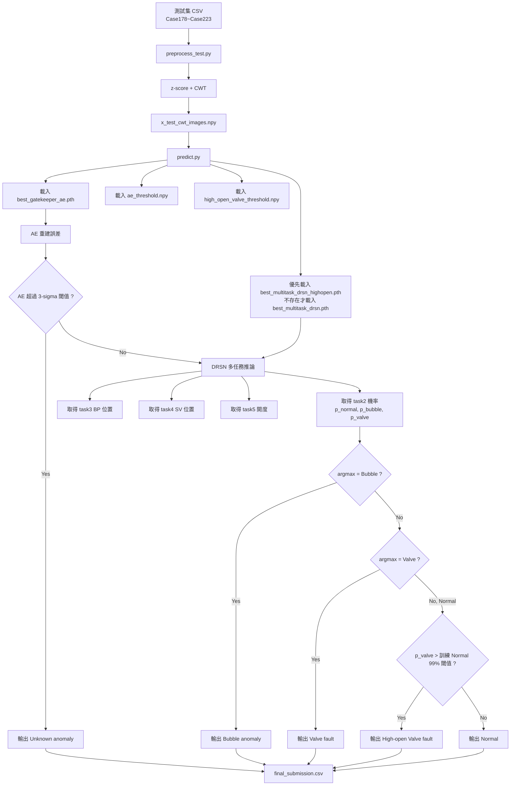

# 航天推進系統多任務智能診斷方案

本專案針對航天推進系統壓力訊號中的 Normal、未知異常、氣泡異常與電磁閥故障進行多任務診斷。新版流程保留原本規劃的「Autoencoder 守門員 + MultiTask DRSN 主診斷模型 + Grad-CAM 可視化」架構，並新增一個不依賴 Case ID、不使用測試答案調參的「高開度弱閥門故障安全網」，用來降低真實閥門開度接近 100% 時被誤判為 Normal 的風險。

## 核心目標

- 從 `P1 ~ P7` 七個壓力通道中辨識系統是否異常。
- 區分 Normal、Unknown anomaly、Bubble anomaly、Valve fault。
- 定位氣泡位置 `BP1 ~ BP7`。
- 定位電磁閥位置 `SV1 ~ SV4`。
- 預測閥門健康度 / 開度比例 `task5`。
- 對高真實開度、弱洩漏閥門故障建立安全網，避免漏報為 Normal。
- 使用 Grad-CAM 產生時頻熱度圖，提升診斷可解釋性。

## 專案目錄

```text
our_method/
├── models.py                         # MultiTaskDRSN 與 AutoencoderGatekeeper
├── preprocess_train.py               # 訓練集 CWT 前處理
├── preprocess_test.py                # 測試集 CWT 前處理
├── train.py                          # 原始 AE + DRSN 訓練流程
├── train_high_open_aug.py            # 高開度弱閥門故障增強 fine-tune
├── predict.py                        # 最終推論與融合決策流程
├── evaluate.py                       # 本地答案對照評估工具
├── best_gatekeeper_ae.pth            # AE 權重
├── best_multitask_drsn.pth           # 原始 DRSN 權重
├── best_multitask_drsn_highopen.pth  # 高開度弱故障強化 DRSN 權重
├── ae_threshold.npy                  # AE 正常重建誤差 3-sigma 閾值
├── high_open_valve_threshold.npy     # 訓練 Normal 校準出的高開度閥門安全閾值
├── final_submission.csv              # 推論輸出
└── gradcam_results/                  # Grad-CAM 可視化結果
```

## 任務定義

最終輸出包含 `task1 ~ task5`：

| 欄位 | 意義 | 數值定義 |
| --- | --- | --- |
| `task1` | 是否異常 | `0=Normal`, `1=Abnormal` |
| `task2` | 官方粗分類 | `0=Normal`, `1=Unknown`, `2=Bubble`, `3=Valve` |
| `task3` | 氣泡位置 | `0=None`, `1~7=BP1~BP7` |
| `task4` | 閥門位置 | `0=None`, `1~4=SV1~SV4` |
| `task5` | 開度 / 健康度 | `0~100` |

模型內部的 `task2` 與官方輸出不同，需要映射：

```text
模型 task2 = 0 -> 官方 task2 = 0 Normal
模型 task2 = 1 -> 官方 task2 = 2 Bubble
模型 task2 = 2 -> 官方 task2 = 3 Valve
AE 判定未知異常 -> 官方 task2 = 1 Unknown
```

## 完整流程圖



## 訓練流程圖



## 推論流程圖



## 關鍵模型設計

### AutoencoderGatekeeper

Autoencoder 只看 Normal 資料，負責學習正常時頻圖的重建能力。若測試資料重建誤差明顯超過 Normal 分布，就視為未知異常。

優點：

- 不需要未知異常標籤。
- 能攔截 DRSN 沒學過的模式。
- 與多任務模型形成雙模型防線。

### MultiTaskDRSN

DRSN 主幹包含殘差收縮模組：

```text
Conv -> BN -> ReLU -> Conv -> BN -> Soft Thresholding -> Residual Add
```

Soft Thresholding 用通道注意力估計閾值，抑制隨機雜訊與弱相關振盪，保留更有診斷意義的時頻特徵。

多任務頭：

```text
head_t1: 是否異常
head_t2: Normal / Bubble / Valve
head_t3: 氣泡位置
head_t4: 閥門位置
head_t5: 開度回歸
```

## 高開度弱閥門故障安全網

原始模型在高真實開度閥門故障上容易漏報，原因是：

```text
開度 94%~98% 的閥門故障波形非常接近 Normal
訓練集中高開度弱故障樣本不足
模型主分類容易偏向 Normal
```

因此新增兩步：

1. 合成高開度弱故障樣本並 fine-tune：

```text
synthetic = (1 - alpha) * normal_sample + alpha * valve_fault_sample
task5 = 94, 95, 96, 97, 98
```

2. 用訓練 Normal 校準安全閾值：

```text
high_open_valve_threshold = quantile(normal_train_valve_prob, 0.99)
```

推論時：

```text
若模型主分類為 Normal
但 valve_prob > high_open_valve_threshold
則輸出 Valve fault
```

這個規則不使用測試 Case ID，不使用測試答案，也不依賴人工指定 199、205、211。

## 不作弊原則

目前正式推論流程遵守以下限制：

- 不使用 `case_id == 199`、`case_id == 205`、`case_id == 211` 這類硬編碼。
- 不使用 `case_id in [...]` 來指定答案。
- 高開度閥門閾值只來自訓練集 Normal 分布。
- 高開度弱故障樣本由訓練資料合成，不讀取測試答案。
- `evaluate.py` 僅用於本地對照，不參與 `predict.py` 推論。

## 執行流程

### 1. 訓練資料前處理

```bash
python preprocess_train.py
```

輸出：

```text
dataset/dataset/train/processed/x_cwt_images.npy
dataset/dataset/train/processed/y_t1.npy
dataset/dataset/train/processed/y_t2.npy
dataset/dataset/train/processed/y_t3.npy
dataset/dataset/train/processed/y_t4.npy
dataset/dataset/train/processed/y_t5.npy
dataset/dataset/train/processed/y_weak_mask.npy
```

### 2. 原始 AE + DRSN 訓練

```bash
python train.py
```

輸出：

```text
best_gatekeeper_ae.pth
best_multitask_drsn.pth
ae_threshold.npy
```

### 3. 高開度弱故障 fine-tune

```bash
python train_high_open_aug.py
```

輸出：

```text
best_multitask_drsn_highopen.pth
high_open_valve_threshold.npy
```

### 4. 測試資料前處理

```bash
python preprocess_test.py
```

輸出：

```text
dataset/dataset/test/processed/x_test_cwt_images.npy
```

### 5. 推論

```bash
python predict.py
```

輸出：

```text
final_submission.csv
gradcam_results/*.png
```

### 6. 本地對照評估

```bash
python evaluate.py
```

目前對照結果：

```text
Task2 分類準確度：100.00%
Task5 開度 MAE：1.22%
Task1~Task5 全任務完全一致率：80.43%
```

## 目前限制

新版流程已解決高開度閥門故障被誤判為 Normal 的問題，但仍有兩點限制：

1. 高開度弱故障的閥門位置定位仍可能不穩。
2. `task5` 開度回歸在部分低開度故障上仍有較大誤差。

後續可改進方向：

- 對高開度弱故障加入更精細的 SV 位置約束。
- 在 `train_high_open_aug.py` 中加入位置保持損失。
- 使用物理拓撲關係建立 `SV -> P channel response` 約束。
- 將 Grad-CAM 熱區與閥門位置任務建立一致性正則化。

